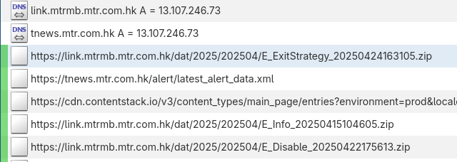

# MTR Tracking

Some utilities i use to track MTR frequencies and other stuff.

Public API Docs: https://opendata.mtr.com.hk/doc/Next_Train_API_Spec_v1.7.pdf

## MTR API Secrets

### Private App API
The MTR App uses a non-documented internal API. Trying to open the app on a rooted phone brings up a warning claiming something along the lines of the device not being secure. Well MTR, if anything its more secure because I can block all the spyware built into the app. Anyway, after bypassing the warning since I am root, we get some juicy APIs in [mitmproxy](https://github.com/mitmproxy/mitmproxy).

Most are protected with an "API Key" with the value `6d15628435284db49b71951ac1a66ac1` (as of 2025-05-01). This value seems hardcoded in the app.

On startup it gets a list of all the lines and stations via `GET https://proxy001.api.mtr.com.hk/ttp-api/v3/api/StationBaseInfo/HRStations?version=20250424184754` (this request does NOT need the API key!). For an example response see [`HRStations.json`](./HRStations.json). The response has some station & line info, e.g.:

```json
{
    "ID": 69,
    "alias": "FOT",
    "nameEN": "Fo Tan",
    "nameTC": "火炭",
    "lineIDs": [
        17
    ],
    "coordinate": "22.3951330,114.1980690"
}
```

On the next restart, the app makes 3 VERY interesting requests:



The `ExitStrategy` zip file contains a SQLite database in [E_ExitStrategy.db](./E_ExitStrategy.db)

```
$ file E_ExitStrategy.db
E_ExitStrategy.db: SQLite 3.x database, last written using SQLite version 3007010, page size 1024, file counter 8, database pages 1526, cookie 0x7, schema 4, UTF-8, version-valid-for 8
```

Which contains details  of which door to use for optimizing certain escalators (exit) or interchanges. 

For instance, if you're taking the Island Line towards Kennedy town and trying to get to [the pub](https://maps.app.goo.gl/AzXimFPThkBCnt2dA) quickly, you should be at Door 4-2

```
sqlite> SELECT * FROM Exit WHERE Station = 'WAC' AND Exit = 'C' AND Direction = 'KET';
+-----------+---------+------+------+-----------+----------+--------------------------------+-----------+---------+-------+-----+------+-----------+--------+-------------+
| StationID | Station | Exit | Line | Direction | Platform |              Day               | StartTime | EndTime | Fleet | Car | Door | Facility  | Active | EscalatorNo |
+-----------+---------+------+------+-----------+----------+--------------------------------+-----------+---------+-------+-----+------+-----------+--------+-------------+
| 27        | WAC     | C    | ISL  | KET       | 2        | Mon,Tue,Wed,Thu,Fri,Sat,Sun,PH | 0000      | 2359    | 8     | 4   | 2    | Escalator | 1      | E6+E8       |
| 27        | WAC     | C    | ISL  | KET       | 2        | Mon,Tue,Wed,Thu,Fri,Sat,Sun,PH | 0000      | 2359    | 8     | 4   | 2    | Lift      | 1      | L1          |
+-----------+---------+------+------+-----------+----------+--------------------------------+-----------+---------+-------+-----+------+-----------+--------+-------------+
```

Or if you're on the Brown Line towards Tuen Mun, and want to change at Ho Man Tin to go towards Whampoa, you should be at Door 5-5

```
sqlite> SELECT * FROM Transfer WHERE Station = 'HOM' AND FromDirection = 'TUM' AND ToDirection = 'WHA' LIMIT 40;
+-----------+---------+--------+-------------+------------+------------+-------------+----------+---------------+--------------+---------------+-------------+--------------+-----------+--------+--------------------------------+-----------+---------+-------------+
| StationID | Station | ToLine | ToDirection | ToPlatform | EnterToCar | EnterToDoor | FromLine | FromDirection | FromPlatform | ExitFromFleet | ExitFromCar | ExitFromDoor | Facility  | Active |              Day               | StartTime | EndTime | EscalatorNo |
+-----------+---------+--------+-------------+------------+------------+-------------+----------+---------------+--------------+---------------+-------------+--------------+-----------+--------+--------------------------------+-----------+---------+-------------+
| 84        | HOM     | KTL    | WHA         | 2          | 1          | 1           | TML      | TUM           | 3            | 8             | 5           | 5            | Escalator | 1      | Mon,Tue,Wed,Thu,Fri,Sat,Sun,PH | 0000      | 2359    | ES10+ES6    |
```

TODO: Add some more endpoints

### Public API 
The response for East Rail Line `GET /v1/transport/mtr/getSchedule.php` is different to others. E.g.:

Island Line (ADM)
```json
{
    "seq": "1",
    "dest": "CHW",
    "plat": "3",
    "time": "2025-03-29 17:25:28",
    "ttnt": "1",
    "valid": "Y",
    "source": "-"
}
```

vs

East Rail Line (SHT)
```json
{
    "seq": "2",
    "dest": "LOW",
    "plat": "2",
    "time": "2025-03-29 17:27:59",
    "ttnt": "3",
    "valid": "Y",
    "source": "-",
    "route": "",
    "timeType": "A"
}
```

There is a undocumented `route` field in the response! This is empty for the "default" trains (via Fo Tan), however it is populated with `RAC` for trains via racecourse.
